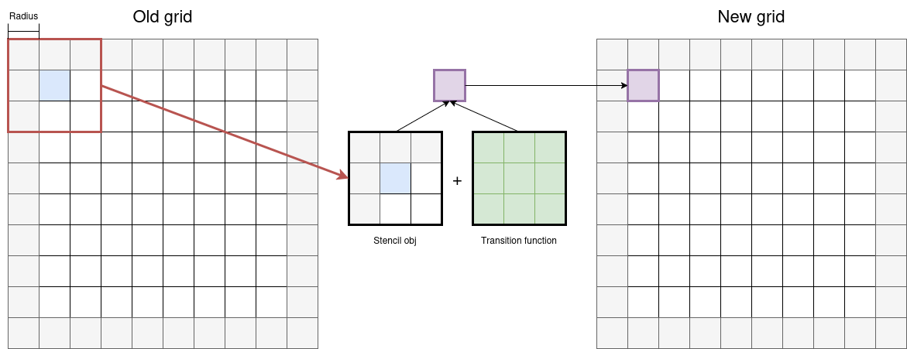

StencilStream is a very versatile framework which leaves you plenty of opertunities to create the programm as you like. In this section, we are going to look at some of the basic concepts a programm written in Stencilstream needs to have to run sucessfully.

## Select the correct Backend

The first step is to select a backend on which the calculations will be excecuted

> Stencilstream does currently not support multiple backends in a programm!

Currently, StencilStream supports 4 backends:

1. monotile (FPGA)
1. tiling (FPGA)
1. cpu (x86)
2. cuda (NVIDIA)

If you want to build your code for only one backend, it is enough to include the correct ```StenciUpdater.hpp```. The header files are located in the StencilStream/*"backend"* directories. The backend can is selected by including the desierd header file like:
```cpp
#include <StencilStream/"backend"/StencilUpdate.hpp>
```

If you want to select more than 1 backend and also build it for other backends, there are three variables which can be set during compilation to select a backend:

1. STENCILSTREAM_BACKEND_MONOTILE
1. STENCILSTREAM_BACKEND_TILING
1. STENCILSTREAM_BACKEND_CPU
1. STENCILSTREAM_BACKEND_CUDA

The following code shows how to select each backend, based on the compiler flags:

```cpp
#elif defined(STENCILSTREAM_BACKEND_MONOTILE)
    #include <StencilStream/monotile/StencilUpdate.hpp>
#elif defined(STENCILSTREAM_BACKEND_TILING)
    #include <StencilStream/tiling/StencilUpdate.hpp>
#if defined(STENCILSTREAM_BACKEND_CPU)
    #include <StencilStream/cpu/StencilUpdate.hpp>
#elif defined(STENCILSTREAM_BACKEND_CUDA)
    #include <StencilStream/cuda/StencilUpdate.hpp>
#endif
```

## Defining a Cell

Now we start by defining a Cell type. A Cell type basically describes how a Cell looks like. One strength of StencilStream is, that it is not limited by any datatypes or design choices. It is required to create a Cell type. A Cell type can vary depending on the program. The simplest cell type is a boolean. It can be defined like:

```cpp
 bool cell;
```

While this a rather simple cell, it is also possible to use other fundamental types like int, float, double, ....

To write more complex simulations like in the hotspot example, we can also use more than one element in a cell. By defining a cell with a vector of two elements:

```cpp
vec<float, 2> cell;
```

While the cells above are fairly limited to only one datatype, it is the strength of Stencilstream to commbine diffrent types in one cell:

```cpp
struct cell {
    bool a, b;
    int c, d;
    float e, f;
    double g, h;
};
```

## Defining a Transitionfunction

Now it is time to actually write a transitionfunction which is the heart of the programm. But before we start, it is important to understand how to use the transision function correctly. The transition function receives a part of the grid as a stencil and calculates the new cell at the given position.



The 